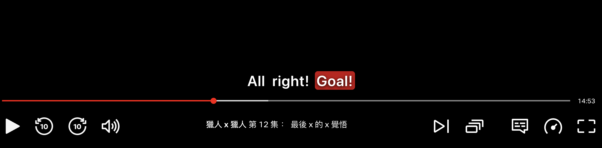
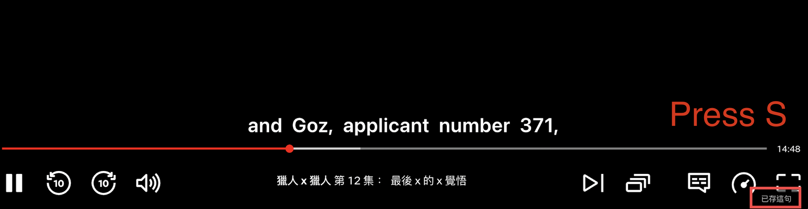
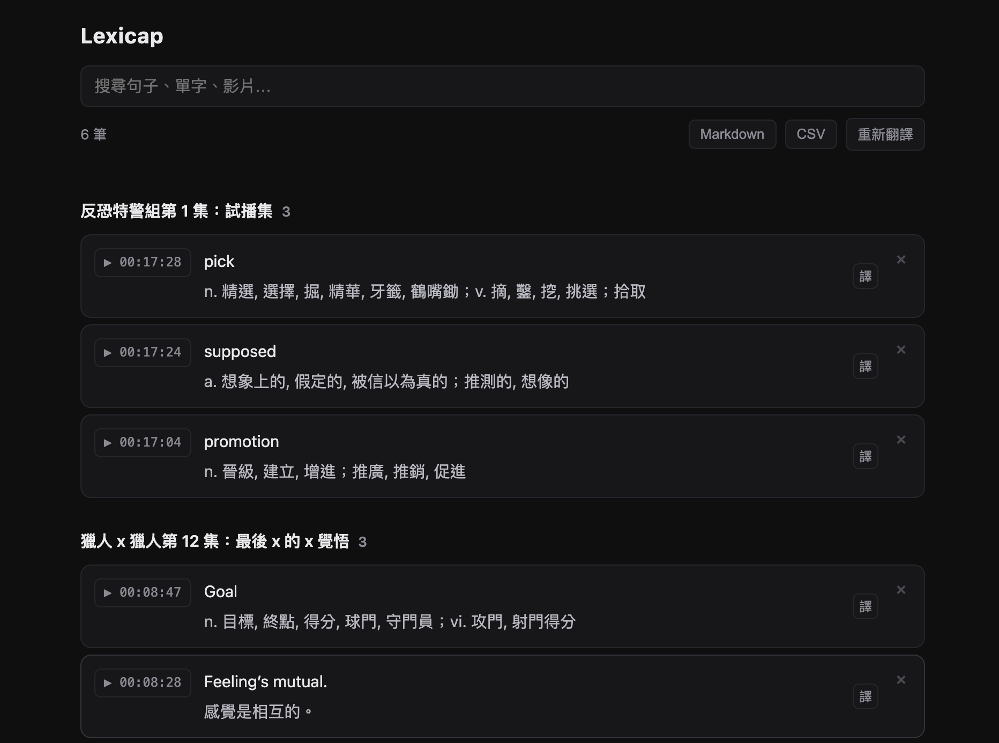

# Lexicap

> 一本會自動長大的看片筆記本。

Chrome 擴充功能。在 Netflix 看英文影集時，**以零中斷的方式**把不熟的單字與句子擷取下來，事後自動附上中文解釋，形成一本可搜尋、可回跳原片的個人單字筆記。

<p align="center">
  
</p>

## 這不是什麼

- ❌ 不是即時翻譯工具（看片當下不顯示翻譯）
- ❌ 不是間隔重複／背誦系統
- ❌ 不是雙語字幕外掛

## 功能

**看片時**

| 動作 | 存什麼 |
|---|---|
| 點字幕上的單字 | 該單字 + 整句 + 前後句 + timestamp |
| 按 `S` | 當前正在播的整句 |
| 按 `A` | 上一句 |



不暫停影片，右下角 1 秒微型提示。原生字幕由自繪 Overlay 取代，字幕講完會**停留到下一句**，滑鼠移入會**凍結當前句**。



**只在英文字幕時接管。** 切到中文或關掉字幕就完全休眠，畫面跟沒裝擴充一樣。

**事後**

點擴充圖示開筆記本：按影片分組、搜尋、`▶` 一鍵回跳到影片那一秒、匯出 Markdown / CSV。



**自動解釋**

- 單字 → 查打包的離線英漢詞典，列出**所有義項**
- 整句 → Chrome 內建 Translator API

零設定、離線、免費，不需要任何 API key。

## 開發

```bash
pnpm install
pnpm build          # → dist/chrome-mv3
pnpm compile        # tsc --noEmit
pnpm dev            # 開發模式（會開全新 Chrome profile）
```

載入：`chrome://extensions` → 開發人員模式 → 載入未封裝項目 → 選 `dist/chrome-mv3`

### 重建資料

```bash
pip3 install opencc-python-reimplemented
python3 scripts/build-dictionary.py   # → public/dictionary.json
python3 scripts/build-icons.py        # → public/icon/*.png
```

## 文件

- [`docs/專案計畫書.md`](docs/專案計畫書.md) — 設計決策與理由，含已否決方案
- [`spike/FINDINGS.md`](spike/FINDINGS.md) — Netflix 平台探勘的實測記錄
- [`spike/netflix-probe.js`](spike/netflix-probe.js) — 探勘工具，Netflix 改版時重跑它

> Netflix 沒有公開 API，字幕取得靠逆向。**任何平台細節對不上時請重跑 probe，不要猜。**

## 致謝

詞典資料來自 [ECDICT](https://github.com/skywind3000/ECDICT)（MIT License, © skywind3000），
依詞頻篩選並以 [OpenCC](https://github.com/BYVoid/OpenCC) 轉為繁體中文。

## 授權

MIT
